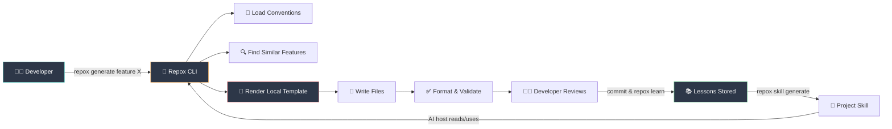
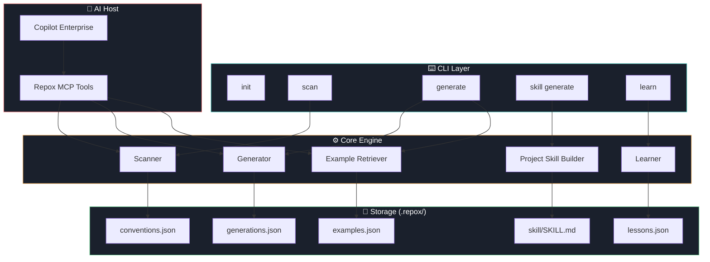
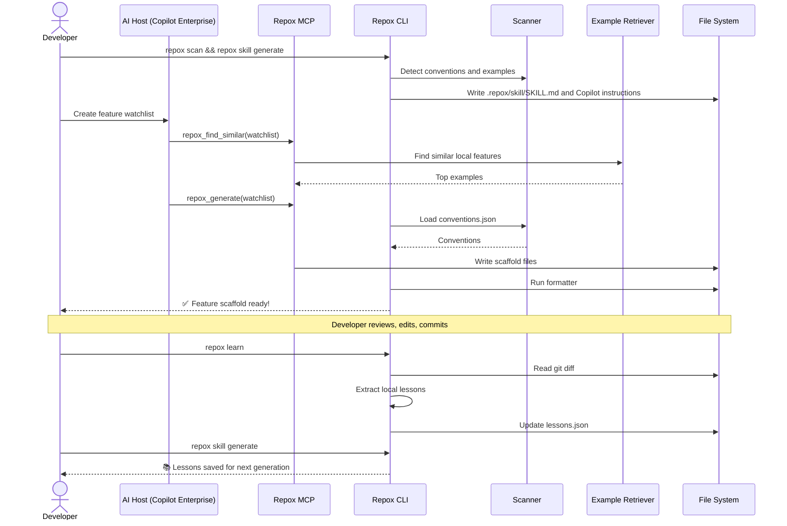
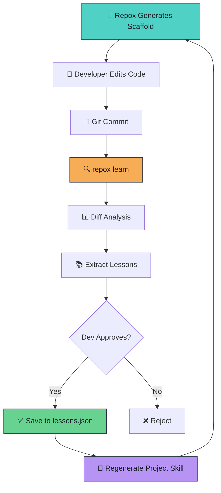

# 🧠 Repox

**Self-learning scaffold generator that understands your repo's conventions.**

> Generate feature scaffolds that look like your team wrote them — learned from real code, improved by every commit.


---

## 🎯 What is Repox?

Repox scans your codebase, maps your project's conventions, generates project-specific AI instructions, and provides local MCP tools. Repox itself has no external AI integration.

```bash
# 1. One-command setup in your Flutter/Go repo
repox setup

# 2. Check whether Repox is ready
repox doctor

# 3. Understand the repo as markdown maps
repox map --open

# 4. Explain conventions for humans or AI agents
repox explain --ai

# 5. Preview an anatomy-aware generation plan
repox plan feature investment/new_feature --like investment/fund_list --ai

# 6. Preview without writing
repox new feature investment/watchlist --like investment/fund_list --preview

# 7. Generate using the shape of an existing feature flow
repox new feature investment/watchlist --like investment/fund_list

# 8. Find similar existing features before generating
repox generate feature watchlist --with-examples

# 9. Refresh a project skill for Copilot Enterprise / AI hosts
repox skill generate

repox learn       # Learn from reviewed local edits
repox learn --list
repox --mcp       # Start as a local MCP server (Claude Code / Copilot / Cursor)
```

---

## 📦 Installation

### Prerequisites

- **Go 1.25+** — [install](https://go.dev/dl/)
- No AI API key is required.

### Install via Go

```bash
go install github.com/ChonlakanSutthimatmongkhol/repox/cmd/repox@latest
```

The binary lands at `$(go env GOPATH)/bin/repox`. Make sure that path is in your `$PATH`.

```bash
# Verify installation
repox --version
```

### Build from source

```bash
git clone https://github.com/ChonlakanSutthimatmongkhol/repox.git
cd repox
make install   # builds and copies to $(go env GOPATH)/bin/
```

### Offline-first setup

```bash
repox init
repox scan
repox skill generate
```

---

## 🤖 MCP Setup (Claude Code · Copilot · Cursor)

Repox runs as a local MCP stdio server so AI tools can call it directly. Repox itself never calls AI providers.

### Step 1 — Run in your project first

```bash
cd /your/flutter-project
repox init    # creates .repox/
repox scan    # detects conventions → .repox/conventions.json
repox skill generate
```

### Step 2 — Add to your AI tool

#### Claude Code (global — all projects)

Add to `~/.claude.json`:

```json
{
  "mcpServers": {
    "repox": {
      "type": "stdio",
      "command": "/Users/<you>/go/bin/repox",
      "args": ["--mcp"]
    }
  }
}
```

> **Tip:** Claude Code inherits your shell's `$PATH`, so if `repox` is already on your PATH you can use `"command": "repox"`.

#### Claude Code (project-only)

Create `.claude/mcp.json` at the project root:

```json
{
  "mcpServers": {
    "repox": {
      "type": "stdio",
      "command": "repox",
      "args": ["--mcp"]
    }
  }
}
```

#### GitHub Copilot (VS Code)

Create `.vscode/mcp.json` at the project root:

```json
{
  "servers": {
    "repox": {
      "type": "stdio",
      "command": "repox",
      "args": ["--mcp"]
    }
  }
}
```

Then open **VS Code** → Command Palette → `MCP: List Servers` to confirm it appears.

#### Cursor

Create or edit `~/.cursor/mcp.json` (global) or `.cursor/mcp.json` (project):

```json
{
  "mcpServers": {
    "repox": {
      "command": "repox",
      "args": ["--mcp"]
    }
  }
}
```

Restart Cursor after saving. The `repox_*` tools should appear in the tool list.

### Step 3 — Ask your AI to use it

Once connected, you can tell your AI assistant:

```
Use repox_scan to detect this project's conventions, then use repox_generate to scaffold a "payments" feature.
```

---

## 🏗️ How It Works



---

## 📐 Architecture



---

## 🔄 Generation Flow



---

## 🚀 Self-Learning Loop



---

## 📁 Project Structure

```
repox/
├── cmd/
│   └── repox/
│       └── main.go                 # Entry point
├── internal/
│   ├── cli/
│   │   ├── root.go                 # Root command, --version
│   │   ├── init.go                 # repox init
│   │   ├── scan.go                 # repox scan          ✅ v0.2.0
│   │   ├── generate.go             # repox generate
│   │   └── skill.go                # repox skill generate
│   ├── scanner/                    #                     ✅ v0.2.0
│   │   ├── scanner.go              # Scanner interface
│   │   ├── flutter_scanner.go      # Flutter orchestrator
│   │   ├── go_scanner.go           # Go scanner (stub, v0.3.0)
│   │   ├── project_detector.go     # flutter/go/node detection
│   │   ├── folder_scanner.go       # Feature root & structure
│   │   ├── naming_scanner.go       # Suffix detection (majority vote)
│   │   ├── import_scanner.go       # Common import ranking
│   │   └── routing_scanner.go      # State mgmt & routing
│   ├── generator/
│   │   ├── naming.go               # ToSnakeCase, ToPascalCase, ToCamelCase
│   │   ├── template_generator.go   # embed.FS template rendering
│   │   └── file_writer.go          # Safe file writer
│   ├── retriever/                  #                     ✅ v0.3.0
│   │   ├── retriever.go            # Retriever interface
│   │   ├── feature_indexer.go      # Walk repo and index features
│   │   ├── similarity.go           # Score similarity between features
│   │   └── retriever_test.go       # Tests
│   ├── learner/                    #                     ✅ v0.5.0
│   │   ├── learner.go              # Learner interface
│   │   ├── diff_reader.go          # Compare snapshots vs current files
│   │   └── learner_test.go         # Tests
│   ├── skill/                      #                     ✅ v0.4.0
│   │   └── generator.go            # Project skill and Copilot instruction builder
│   ├── mcp/                        #                     ✅ v1.0.0
│   │   ├── server.go               # MCP server setup (mark3labs/mcp-go)
│   │   ├── tools.go                # Tool schemas
│   │   ├── handlers.go             # Tool handlers
│   │   └── mcp_test.go             # Tests
│   ├── config/
│   │   └── loader.go               # Generic Load[T]/Save[T], defaults
│   └── models/
│       ├── convention.go           # Convention, NamingConvention, RoutingConfig
│       ├── config.go               # Config
│       ├── example.go              # Example
│       ├── lesson.go               # Lesson
│       └── generation.go           # Generation log
├── templates/
│   └── flutter_bloc_feature/
│       ├── screen.dart.tmpl
│       ├── bloc.dart.tmpl
│       ├── event.dart.tmpl
│       ├── state.dart.tmpl
│       ├── repository.dart.tmpl
│       ├── repository_impl.dart.tmpl
│       ├── usecase.dart.tmpl
│       ├── request.dart.tmpl
│       ├── response.dart.tmpl
│       └── bloc_test.dart.tmpl
├── .repox/                         # Created by `repox init`
│   ├── config.json
│   ├── conventions.json
│   ├── examples.json
│   ├── lessons.json
│   └── generations.json
├── go.mod
├── go.sum
├── Makefile
└── README.md
```

---

## ⚙️ Configuration

### `.repox/config.json`

```json
{
  "version": "0.1.0",
  "project_type": "flutter",
  "feature_root": "lib/features",
  "test_root": "test/features",
  "default_template": "flutter_bloc_feature"
}
```

Repox is offline-only. It has no public/external AI provider integration.

### `.repox/conventions.json`

```json
{
  "project_type": "flutter",
  "state_management": "flutter_bloc",
  "feature_structure": "clean_architecture",
  "feature_root": "lib/features",
  "test_root": "test/features",
  "naming": {
    "class_case": "PascalCase",
    "file_case": "snake_case",
    "screen_suffix": "Screen",
    "bloc_suffix": "Bloc",
    "event_suffix": "Event",
    "state_suffix": "State",
    "repository_suffix": "Repository",
    "usecase_suffix": "UseCase"
  },
  "routing": {
    "type": "go_router",
    "route_file": "lib/router/app_router.dart"
  },
  "common_imports": [
    "package:flutter/material.dart",
    "package:flutter_bloc/flutter_bloc.dart"
  ]
}
```

---

## 📦 Commands

| Command | Description |
|---------|-------------|
| `repox init` | Initialize `.repox/` in your project |
| `repox scan` | Scan repo and save conventions, feature anatomy, and examples to `.repox/` |
| `repox scan --ai` | Scan and print compact AI-friendly markdown |
| `repox setup` | Initialize, scan, and generate `.repox/skill/SKILL.md` in one idempotent command |
| `repox doctor` | Diagnose Repox readiness and suggested fixes |
| `repox explain --ai` | Explain scanned conventions with the AI output contract |
| `repox map --open` | Generate project/convention maps and open rendered map output when available |
| `repox plan feature <name>` | Preview what would be generated without writing files |
| `repox plan feature <name> --ai` | Print an AI-friendly generation plan |
| `repox plan feature <name> --like <existing>` | Preview using an existing feature as the shape reference |
| `repox new feature <name>` | Friendly alias for `repox generate feature <name>` |
| `repox generate feature <name>` | Generate a feature scaffold using scanned conventions |
| `repox generate feature <name> --like <existing>` | Generate using an existing feature's structure and base classes |
| `repox generate feature <name> --roles bloc,event,state,screen` | Generate only the selected role files |
| `repox generate feature <name> --dry-run` | Preview file paths without writing |
| `repox generate feature <name> --preview` | Alias for `--dry-run` |
| `repox generate feature <name> --dry-run --ai` | Print compact AI-friendly dry-run output |
| `repox generate feature <name> --force` | Overwrite existing files |
| `repox generate feature <name> --with-examples` | Show similar existing features before generating |
| `repox template create --name <name> --from <feature>` | Extract a first-pass reusable template from an indexed feature |
| `repox learn` | Learn from reviewed local edits to improve future generations |
| `repox learn --list` | List recorded generations |
| `repox skill generate` | Generate a project skill file for Copilot Enterprise / AI hosts |
| `repox --mcp` | Start as a local MCP server (Claude Code / Copilot / Cursor) |
| `repox --version` | Print current version |

### `--like` flag

`--like <existing-feature>` uses a scanned feature as a shape reference:

- Generates only the roles that exist in the source feature
- Applies the source feature's base classes (e.g. `BaseBlocScreen`, `BaseStatefulWidget`) from scanned anatomy
- Pre-wires the UseCase into the bloc constructor
- Prints a **Next steps** checklist (DI registration, route, repository) after generation
- Ancillary files with no template (enums, route models, skeleton widgets) are copied and renamed from source

---

## 🛡️ Safety

- Offline-only: Repox has no external AI provider integration
- Never sends secrets (`.env`, keys, certificates) to AI
- `--dry-run` mode to preview before writing
- No overwrite without `--force`
- Path allowlist/denylist support
- Local-only mode available
- Audit log of all generations

---

## 🗺️ Roadmap

### ✅ v0.1.0 — Template Generator MVP _(released 2026-05-09)_

> Goal: `repox generate feature watchlist` ทำงานได้โดยไม่ต้องใช้ AI

- ✅ CLI skeleton (init, generate)
- ✅ Go `text/template` engine with `embed.FS`
- ✅ Flutter BLoC feature template (10 files)
- ✅ Naming conversion (snake_case, PascalCase, camelCase)
- ✅ File writer with `--force` / `--dry-run` protection
- ✅ Config: `.repox/config.json`

### ✅ v0.2.0 — Repo Scanner _(released 2026-05-09)_

> Goal: `repox scan` อ่าน repo แล้วสร้าง conventions.json อัตโนมัติ

- ✅ Detect project type (Flutter, Go, Node)
- ✅ Detect feature root & folder structure (clean_architecture / grouped / flat)
- ✅ Detect state management (BLoC, Cubit, Riverpod, Provider)
- ✅ Detect naming conventions from existing files (majority vote)
- ✅ Detect routing (go_router, auto_route) + route file path
- ✅ Detect common imports (top 10 by frequency)
- ✅ Write `.repox/conventions.json`
- ✅ `repox generate` uses scanned conventions automatically

### ✅ v0.3.0 — Example Retrieval _(released 2026-05-09)_

> Goal: `repox generate feature X --with-examples` ใช้ feature เก่าเป็นต้นแบบ

- ✅ Index existing features in repo (`internal/retriever/`)
- ✅ Feature metadata extraction (components, imports, patterns)
- ✅ Similarity scoring (name 0.2 + structure 0.3 + imports 0.2 + patterns 0.3)
- ✅ Top-N example selection (`FindSimilar`)
- ✅ `repox scan` indexes features → `.repox/examples.json`
- ✅ `--with-examples` flag prints similar features before generating

### v0.4.0 — Project Skill Generator

> Goal: `repox skill generate` สร้าง skill ให้ Copilot Enterprise / AI host ใช้ Repox เอง

- Generate `.repox/skill/SKILL.md`
- Generate `.github/copilot-instructions.md` for Copilot Enterprise
- Include conventions, examples, approved lessons, and MCP workflow
- Offline/public-AI policy included in generated instructions
- Protect human-authored Copilot instructions unless `--force`

### v0.5.0 — Offline Self-Learning Loop

> Goal: `repox learn` เรียนรู้จาก diff หลัง dev แก้ code

- Store generation snapshots
- Git diff reader (generated vs committed)
- Local lesson extraction from changed files
- Lesson approve / reject workflow
- Confidence scoring & dedup
- Inject approved lessons into the next generated skill
- Future: suggest template patches from repeated local edits

### ✅ v1.0.0 — MCP Server Mode _(released 2026-05-09)_

> Goal: AI tools เรียก Repox ผ่าน MCP ได้ตรง ไม่ต้องผ่าน CLI

- ✅ MCP server via `repox --mcp` (stdio JSON-RPC)
- ✅ 5 tools: `repox_scan`, `repox_generate`, `repox_find_similar`, `repox_learn`, `repox_explain_convention`
- ✅ Works with: Claude Code, GitHub Copilot, Cursor

### ✅ v1.0.3 — Anatomy-Aware Planning _(released 2026-05-10)_

> Goal: Repox เข้าใจ anatomy ของ role files และให้ user เลือก shape ก่อน generate

- ✅ Nested feature flow memory, e.g. `lib/features/investment/fund_list`
- ✅ Per-role file anatomy: base classes, methods, imports, constructor dependencies, capabilities
- ✅ `repox plan feature <name-or-path>` preview with role anatomy hints
- ✅ `repox generate feature --roles bloc,event,state,screen`
- ✅ `repox generate feature --like investment/fund_list`

### ✅ v1.0.7 — Smart `--like` Generation _(released 2026-05-10)_

> Goal: `--like` generates clean, project-aware scaffolds — not copies of business logic

- ✅ Template-first for known roles: bloc, screen, event, state always use clean stubs — no source business logic copied
- ✅ Base class propagation: templates use base classes from scanned anatomy (`BaseBlocScreen`, `BaseStatefulWidget`)
- ✅ UseCase auto-injection: the generated bloc constructor is pre-wired with the generated UseCase
- ✅ Post-generate **Next steps** checklist: DI registration, route, and repository implementation hints printed after each generation
- ✅ Scanner depth-aware role assignment: primary roles always go to the shallowest file — fixes nested files (e.g. `firebase/`) stealing the primary role
- ✅ Ancillary files (enums, route models, skeleton widgets) still copy-rename from source

### v1.x — Future

- Interactive role/capability picker
- Go backend template (handler / service / repository)
- Jira ticket → scaffold
- API schema → DTO / service / repository
- VS Code extension
- Team convention sharing
- Architecture drift detector

---

## 🔌 MCP Tool Reference

> Full setup instructions are in the [MCP Setup](#-mcp-setup-claude-code--copilot--cursor) section above.

| Tool | Parameters | Description |
|---|---|---|
| `repox_scan` | `project_override?` | Scan repo, detect conventions, index features → saves `.repox/conventions.json` |
| `repox_generate` | `feature_name`, `use_examples?`, `force?`, `dry_run?` | Generate deterministic local scaffold |
| `repox_find_similar` | `feature_name`, `top_n?` | Find structurally similar existing features (default top 3) |
| `repox_learn` | `generation_id?`, `auto_approve?` | Returns CLI usage hint; run `repox learn` then `repox skill generate` in terminal |
| `repox_explain_convention` | — | Return repo conventions in human-readable format |

Works with: **Claude Code** · **GitHub Copilot (VS Code)** · **Cursor**

---

## 📄 License

MIT

---

<p align="center">
  <b>Repox</b> — Your repo already knows its conventions. Let it teach the AI.
</p>
