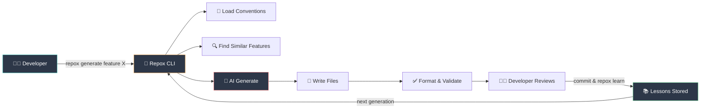
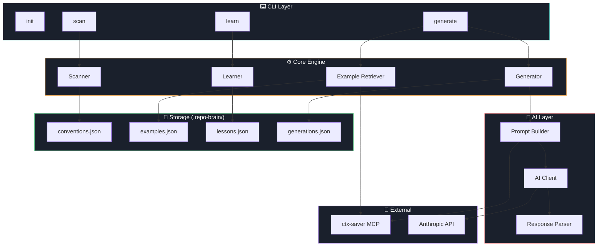
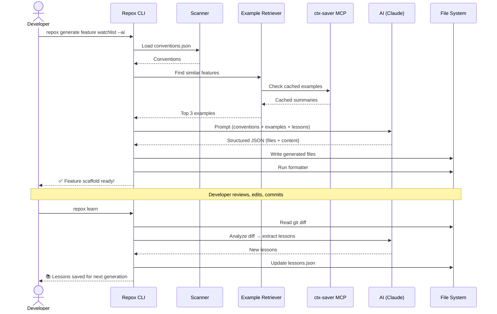
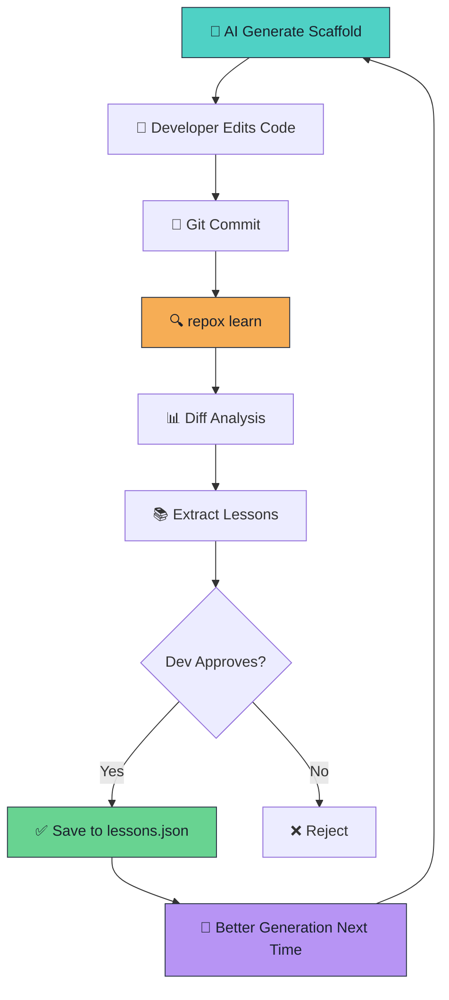

# 🧠 Repox

**Self-learning scaffold generator that understands your repo's conventions.**

> Generate feature scaffolds that look like your team wrote them — learned from real code, improved by every commit.


---

## 🎯 What is Repox?

Repox scans your codebase, learns your project's conventions, and generates feature scaffolds that match your team's style. No more copy-pasting from old features. No more writing AI instructions from scratch for every repo.

```bash
repox init          # Initialize Repox in your repo
repox scan          # Scan and learn conventions
repox generate feature watchlist         # Generate from template
repox generate feature watchlist --ai    # Generate with AI assistance
repox learn         # Learn from your edits
```

---

## 🏗️ How It Works



---

## 📐 Architecture



---

## 🔄 Generation Flow



---

## 🚀 Self-Learning Loop



---

## 📁 Project Structure

```
repox/
├── cmd/
│   └── repox/
│       └── main.go                 # Entry point
├── internal/
│   ├── cli/
│   │   ├── root.go                 # Root command
│   │   ├── init.go                 # repox init
│   │   ├── scan.go                 # repox scan
│   │   ├── generate.go             # repox generate
│   │   └── learn.go                # repox learn
│   ├── scanner/
│   │   ├── scanner.go              # Scanner interface
│   │   ├── flutter_scanner.go      # Flutter project scanner
│   │   ├── go_scanner.go           # Go project scanner (future)
│   │   ├── folder_scanner.go       # Folder structure detection
│   │   └── naming_scanner.go       # Naming convention detection
│   ├── generator/
│   │   ├── generator.go            # Generator interface
│   │   ├── template_generator.go   # Template-based generation
│   │   ├── ai_generator.go         # AI-assisted generation
│   │   └── file_writer.go          # Safe file writer
│   ├── retriever/
│   │   ├── retriever.go            # Example retriever interface
│   │   ├── feature_indexer.go      # Index existing features
│   │   └── similarity.go           # Similarity scoring
│   ├── learner/
│   │   ├── learner.go              # Learner interface
│   │   ├── diff_reader.go          # Git diff reader
│   │   └── lesson_extractor.go     # Extract lessons from diff
│   ├── ai/
│   │   ├── client.go               # AI provider interface
│   │   ├── anthropic.go            # Anthropic implementation
│   │   ├── prompt_builder.go       # Build prompts from context
│   │   └── response_parser.go      # Parse structured AI response
│   ├── config/
│   │   ├── config.go               # Config types
│   │   └── loader.go               # Load/save config files
│   └── models/
│       ├── convention.go           # Convention types
│       ├── example.go              # Example types
│       ├── lesson.go               # Lesson types
│       └── generation.go           # Generation log types
├── templates/
│   └── flutter_bloc_feature/
│       ├── screen.dart.tmpl
│       ├── bloc.dart.tmpl
│       ├── event.dart.tmpl
│       ├── state.dart.tmpl
│       ├── repository.dart.tmpl
│       ├── repository_impl.dart.tmpl
│       ├── usecase.dart.tmpl
│       ├── request.dart.tmpl
│       ├── response.dart.tmpl
│       └── bloc_test.dart.tmpl
├── .repox/                         # Created by `repox init`
│   ├── config.json
│   ├── conventions.json
│   ├── examples.json
│   ├── lessons.json
│   └── generations.json
├── go.mod
├── go.sum
├── Makefile
└── README.md
```

---

## ⚙️ Configuration

### `.repox/config.json`

```json
{
  "version": "0.1.0",
  "project_type": "flutter",
  "feature_root": "lib/features",
  "test_root": "test/features",
  "default_template": "flutter_bloc_feature",
  "ai": {
    "provider": "anthropic",
    "generation_model": "claude-sonnet-4-20250514",
    "learning_model": "claude-haiku-4-5-20251001"
  }
}
```

### `.repox/conventions.json`

```json
{
  "project_type": "flutter",
  "state_management": "flutter_bloc",
  "feature_structure": "clean_architecture",
  "feature_root": "lib/features",
  "test_root": "test/features",
  "naming": {
    "class_case": "PascalCase",
    "file_case": "snake_case",
    "screen_suffix": "Screen",
    "bloc_suffix": "Bloc",
    "event_suffix": "Event",
    "state_suffix": "State",
    "repository_suffix": "Repository",
    "usecase_suffix": "UseCase"
  },
  "routing": {
    "type": "go_router",
    "route_file": "lib/router/app_router.dart"
  },
  "common_imports": [
    "package:flutter/material.dart",
    "package:flutter_bloc/flutter_bloc.dart"
  ]
}
```

---

## 📦 Generated Output Example

```bash
repox generate feature watchlist
```

```
✅ Generated 10 files for feature: watchlist

  lib/features/watchlist/
  ├── presentation/
  │   ├── screen/
  │   │   └── watchlist_screen.dart
  │   └── bloc/
  │       ├── watchlist_bloc.dart
  │       ├── watchlist_event.dart
  │       └── watchlist_state.dart
  ├── domain/
  │   ├── usecase/
  │   │   └── get_watchlist_usecase.dart
  │   └── repository/
  │       └── watchlist_repository.dart
  └── data/
      ├── repository/
      │   └── watchlist_repository_impl.dart
      └── model/
          ├── watchlist_request.dart
          └── watchlist_response.dart

  test/features/watchlist/
  └── watchlist_bloc_test.dart
```

---

## 🛡️ Safety

- Never sends secrets (`.env`, keys, certificates) to AI
- `--dry-run` mode to preview before writing
- No overwrite without `--force`
- Path allowlist/denylist support
- Local-only mode available
- Audit log of all generations

---

## 🗺️ Roadmap

### v0.1.0 — Template Generator MVP

> Goal: `repox generate feature watchlist` ทำงานได้โดยไม่ต้องใช้ AI

- CLI skeleton (init, generate)
- Go `text/template` engine with `embed.FS`
- Flutter BLoC feature template
- Naming conversion (snake_case, PascalCase, camelCase)
- File writer with `--force` / `--dry-run` protection
- Config: `.repox/config.json`

### v0.2.0 — Repo Scanner

> Goal: `repox scan` อ่าน repo แล้วสร้าง conventions.json อัตโนมัติ

- Detect project type (Flutter, Go)
- Detect feature root & folder structure
- Detect state management (BLoC, Cubit, Riverpod)
- Detect naming conventions from existing files
- Detect routing (go_router, auto_route)
- Detect common imports & design system packages
- Generate `.repox/conventions.json`
- Generate uses conventions for smarter scaffolding

### v0.3.0 — Example Retrieval

> Goal: `repox generate feature X --with-examples` ใช้ feature เก่าเป็นต้นแบบ

- Index existing features in repo
- Feature metadata extraction
- Similarity scoring (structure, imports, patterns)
- Top-N example selection
- Template rendering references examples
- Integration with ctx-saver MCP for caching examples

### v0.4.0 — AI-Assisted Generation

> Goal: `repox generate feature X --ai` ให้ AI generate code ตาม convention จริง

- AI provider abstraction (Anthropic as default)
- Prompt builder (conventions + examples + lessons)
- Structured JSON response parsing
- Token budget control via ctx-saver
- Model selection: Sonnet (default) / Opus (`--opus`)
- Formatter & analyzer integration
- `--diff` mode to preview changes

### v0.5.0 — Self-Learning Loop

> Goal: `repox learn` เรียนรู้จาก diff หลัง dev แก้ code

- Store generation snapshots
- Git diff reader (generated vs committed)
- Lesson extraction via AI (Haiku)
- Lesson approve / reject workflow
- Confidence scoring & dedup
- Inject lessons into next generation prompt

### v1.0.0 — MCP Server Mode

> Goal: AI tools เรียก Repox ผ่าน MCP ได้ตรง ไม่ต้องผ่าน CLI

- MCP server implementation
- Tools: `repox.scan`, `repox.generate`, `repox.learn`, `repox.explain_convention`
- Chain with ctx-saver MCP
- Works with: Claude Code, Copilot, Cursor

### v1.x — Future

- Go backend template (handler / service / repository)
- Jira ticket → scaffold
- API schema → DTO / service / repository
- VS Code extension
- Team convention sharing
- Architecture drift detector

---

## 🔌 MCP Integration (Future)

```
repox.scan                  → Scan repo conventions
repox.generate              → Generate feature scaffold
repox.find_similar          → Find similar existing features
repox.learn                 → Learn from git diff
repox.explain_convention    → Explain repo conventions
```

Works with: **Claude Code** · **GitHub Copilot** · **Cursor**

---

## 📄 License

MIT

---

<p align="center">
  <b>Repox</b> — Your repo already knows its conventions. Let it teach the AI.
</p>
