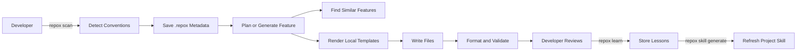
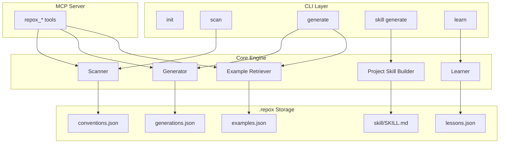

# Repox

**Self-learning scaffold generator that understands your repo's conventions.**

Repox scans your codebase, maps your project conventions, generates project-specific AI instructions, and exposes local MCP tools. It is offline-first and does not call external AI providers.


## Table of Contents

- [Quick Start](#quick-start)
- [Installation](#installation)
- [Feature Generation](#feature-generation)
- [MCP Setup](#mcp-setup)
- [Command Reference](#command-reference)
- [Configuration](#configuration)
- [How It Works](#how-it-works)
- [Project Structure](#project-structure)
- [MCP Tool Reference](#mcp-tool-reference)
- [Safety](#safety)
- [License](#license)

## Quick Start

Run Repox inside your Flutter or Go project:

```bash
# 1. Set up .repox/ and scan the project
repox setup

# 2. Check readiness
repox doctor

# 3. Generate readable project maps
repox map --open

# 4. Explain detected conventions for humans or AI agents
repox explain --ai

# 5. Preview an anatomy-aware plan
repox plan feature customer_profile/saving_target/new_feature \
  --like customer_profile/saving_target/landing \
  --ai

# 6. Preview generated files without writing
repox generate feature customer_profile/saving_target/new_feature \
  --like customer_profile/saving_target/landing \
  --roles bloc,event,state,screen,widget \
  --dry-run

# 7. Generate files using an existing feature as the shape reference
repox generate feature customer_profile/saving_target/new_feature \
  --like customer_profile/saving_target/landing \
  --roles bloc,event,state,screen,widget

# 8. Refresh project instructions for AI hosts
repox skill generate
```

## Installation

### Prerequisites

- Go 1.25 or newer: <https://go.dev/dl/>
- No AI API key is required.

### Install via Go

```bash
go install github.com/ChonlakanSutthimatmongkhol/repox/cmd/repox@latest
```

The binary is installed at `$(go env GOPATH)/bin/repox`. Make sure that directory is in your `PATH`.

```bash
repox --version
```

### Build from Source

```bash
git clone https://github.com/ChonlakanSutthimatmongkhol/repox.git
cd repox
make install
```

### Offline Setup

```bash
repox init
repox scan
repox skill generate
```

## Feature Generation

Repox can generate a new feature from scanned conventions, or use an existing feature as a shape reference.

### Preview from an Existing Feature

```bash
repox generate feature customer_profile/saving_target/new_feature \
  --like customer_profile/saving_target/landing \
  --roles bloc,event,state,screen,widget \
  --dry-run
```

This previews the files for `customer_profile/saving_target/new_feature` without writing them. It reuses the structure, base classes, and role anatomy from `customer_profile/saving_target/landing`, then limits output to the selected roles.

### Generate from an Existing Feature

```bash
repox generate feature customer_profile/saving_target/new_feature \
  --like customer_profile/saving_target/landing \
  --roles bloc,event,state,screen,widget
```

### Plan Before Generating

```bash
repox plan feature customer_profile/saving_target/new_feature \
  --like customer_profile/saving_target/landing \
  --ai
```

### `--like`

`--like <existing-feature>` uses a scanned feature as a shape reference.

- Generates only the roles that exist in the source feature, unless `--roles` is provided.
- Applies scanned base classes such as `BaseBlocScreen` or `BaseStatefulWidget`.
- Pre-wires generated UseCase dependencies into the bloc constructor.
- Prints a next-step checklist for DI registration, route wiring, and repository work.
- Copies and renames ancillary files that do not have templates, such as enums, route models, and skeleton widgets.

### `--roles`

Use `--roles` to limit generation to specific role files.

```bash
repox generate feature <name> --roles bloc,event,state,screen,widget
```

Common roles include `bloc`, `event`, `state`, `screen`, `widget`, `repository`, `usecase`, `request`, `response`, and `test`.

## MCP Setup

Repox runs as a local MCP stdio server so AI tools can call it directly. Repox itself never calls AI providers.

### 1. Prepare the Project

```bash
cd /your/flutter-project
repox init
repox scan
repox skill generate
```

### 2. Configure Your AI Tool

#### Claude Code, Global

Add to `~/.claude.json`:

```json
{
  "mcpServers": {
    "repox": {
      "type": "stdio",
      "command": "/Users/<you>/go/bin/repox",
      "args": ["--mcp"]
    }
  }
}
```

If `repox` is already on your `PATH`, you can use `"command": "repox"`.

#### Claude Code, Project Only

Create `.claude/mcp.json` at the project root:

```json
{
  "mcpServers": {
    "repox": {
      "type": "stdio",
      "command": "repox",
      "args": ["--mcp"]
    }
  }
}
```

#### GitHub Copilot in VS Code

Create `.vscode/mcp.json` at the project root:

```json
{
  "servers": {
    "repox": {
      "type": "stdio",
      "command": "repox",
      "args": ["--mcp"]
    }
  }
}
```

Then open the VS Code Command Palette and run `MCP: List Servers`.

#### Cursor

Create or edit `~/.cursor/mcp.json` globally, or `.cursor/mcp.json` in the project:

```json
{
  "mcpServers": {
    "repox": {
      "command": "repox",
      "args": ["--mcp"]
    }
  }
}
```

Restart Cursor after saving. The `repox_*` tools should appear in the tool list.

### 3. Ask Your AI Assistant to Use Repox

```text
Use repox_scan to detect this project's conventions, then use repox_generate to scaffold a "payments" feature.
```

## Command Reference

### Setup and Discovery

| Command | Description |
|---|---|
| `repox init` | Initialize `.repox/` in your project. |
| `repox scan` | Scan the repo and save conventions, feature anatomy, and examples to `.repox/`. |
| `repox scan --ai` | Scan and print compact AI-friendly markdown. |
| `repox setup` | Initialize, scan, and generate `.repox/skill/SKILL.md` in one idempotent command. |
| `repox doctor` | Diagnose Repox readiness and suggested fixes. |
| `repox explain --ai` | Explain scanned conventions with the AI output contract. |
| `repox map --open` | Generate project and convention maps, then open the rendered map when available. |

### Planning and Generation

| Command | Description |
|---|---|
| `repox plan feature <name>` | Preview what would be generated without writing files. |
| `repox plan feature <name> --ai` | Print an AI-friendly generation plan. |
| `repox plan feature <name> --like <existing>` | Preview using an existing feature as the shape reference. |
| `repox new feature <name>` | Friendly alias for `repox generate feature <name>`. |
| `repox generate feature <name>` | Generate a feature scaffold using scanned conventions. |
| `repox generate feature <name> --like <existing>` | Generate using an existing feature's structure and base classes. |
| `repox generate feature <name> --roles bloc,event,state,screen,widget` | Generate only the selected role files. |
| `repox generate feature <name> --dry-run` | Preview file paths without writing. |
| `repox generate feature <name> --preview` | Alias for `--dry-run`. |
| `repox generate feature <name> --dry-run --ai` | Print compact AI-friendly dry-run output. |
| `repox generate feature <name> --force` | Overwrite existing files. |
| `repox generate feature <name> --with-examples` | Show similar existing features before generating. |

### Learning, Templates, and MCP

| Command | Description |
|---|---|
| `repox template create --name <name> --from <feature>` | Extract a first-pass reusable template from an indexed feature. |
| `repox learn` | Learn from reviewed local edits to improve future generations. |
| `repox learn --list` | List recorded generations. |
| `repox skill generate` | Generate a project skill file for Copilot Enterprise and other AI hosts. |
| `repox --mcp` | Start as a local MCP server for Claude Code, GitHub Copilot, or Cursor. |
| `repox --version` | Print the current version. |

## Configuration

Repox stores project-local state in `.repox/`.

### `.repox/config.json`

```json
{
  "version": "0.1.0",
  "project_type": "flutter",
  "feature_root": "lib/features",
  "test_root": "test/features",
  "default_template": "flutter_bloc_feature"
}
```

### `.repox/conventions.json`

```json
{
  "project_type": "flutter",
  "state_management": "flutter_bloc",
  "feature_structure": "clean_architecture",
  "feature_root": "lib/features",
  "test_root": "test/features",
  "naming": {
    "class_case": "PascalCase",
    "file_case": "snake_case",
    "screen_suffix": "Screen",
    "bloc_suffix": "Bloc",
    "event_suffix": "Event",
    "state_suffix": "State",
    "repository_suffix": "Repository",
    "usecase_suffix": "UseCase"
  },
  "routing": {
    "type": "go_router",
    "route_file": "lib/router/app_router.dart"
  },
  "common_imports": [
    "package:flutter/material.dart",
    "package:flutter_bloc/flutter_bloc.dart"
  ]
}
```

Repox is offline-only. It has no public or external AI provider integration.

## How It Works



### Architecture



## Project Structure

```text
repox/
|-- cmd/
|   `-- repox/
|       `-- main.go
|-- internal/
|   |-- cli/
|   |-- config/
|   |-- generator/
|   |-- learner/
|   |-- mcp/
|   |-- models/
|   |-- retriever/
|   |-- scanner/
|   `-- skill/
|-- templates/
|   `-- flutter_bloc_feature/
|-- .repox/
|   |-- config.json
|   |-- conventions.json
|   |-- examples.json
|   |-- lessons.json
|   `-- generations.json
|-- go.mod
|-- go.sum
|-- Makefile
`-- README.md
```

## MCP Tool Reference

Full setup instructions are in [MCP Setup](#mcp-setup).

| Tool | Parameters | Description |
|---|---|---|
| `repox_scan` | `project_override?` | Scan the repo, detect conventions, index features, and save `.repox/conventions.json`. |
| `repox_generate` | `feature_name`, `use_examples?`, `force?`, `dry_run?` | Generate deterministic local scaffolds. |
| `repox_find_similar` | `feature_name`, `top_n?` | Find structurally similar existing features. |
| `repox_learn` | `generation_id?`, `auto_approve?` | Return CLI usage hints for `repox learn` and `repox skill generate`. |
| `repox_explain_convention` | - | Return repo conventions in human-readable format. |

Works with Claude Code, GitHub Copilot in VS Code, and Cursor.

## Safety

- Offline-only: Repox has no external AI provider integration.
- No AI API key is required.
- Secrets such as `.env`, keys, and certificates are never sent to AI.
- `--dry-run` previews file paths before writing.
- Existing files are not overwritten unless `--force` is provided.
- Path allowlist and denylist support is available.
- Generation activity is recorded locally.

## License

MIT

---

<p align="center">
  <b>Repox</b> - Your repo already knows its conventions. Let it teach the AI.
</p>
